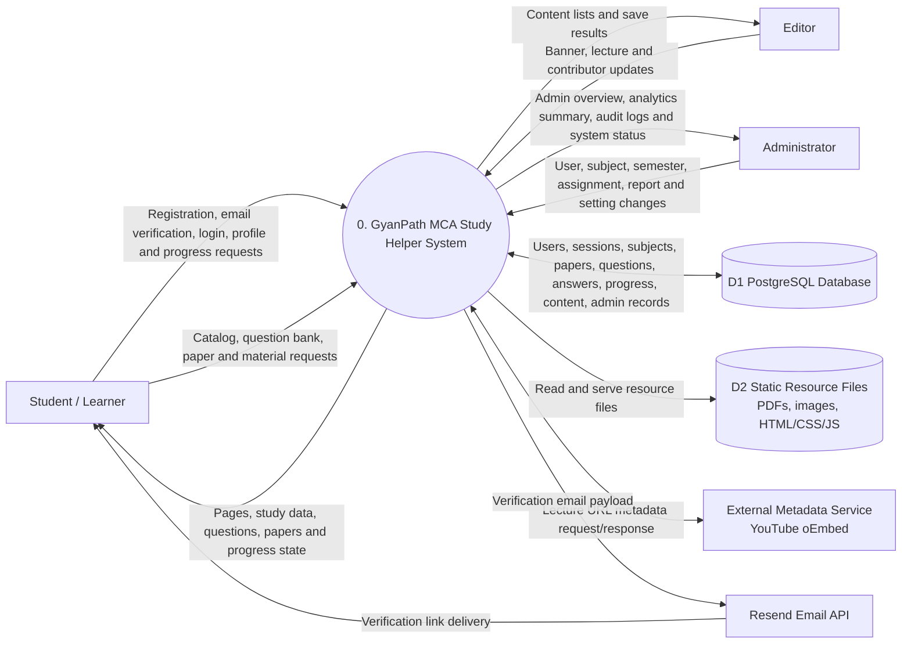

# DFD Level-0

## Explanation

This Level-0 Data Flow Diagram shows the system as one main process and highlights the major external actors, data stores and high-level data movements.

## Notes / Assumptions

- `D1 PostgreSQL Database` represents the Prisma-managed database models in `backend/prisma/schema.prisma`.
- `D2 Static Resource Files` represents files under the frontend assets/resources folders, including PDFs and cached images.
- YouTube metadata fetching occurs only for the implemented lecture metadata endpoint used by Admin/Editor content management.
- Resend receives the recipient, subject and email content; its API key stays in server environment variables and is not stored in the database.
