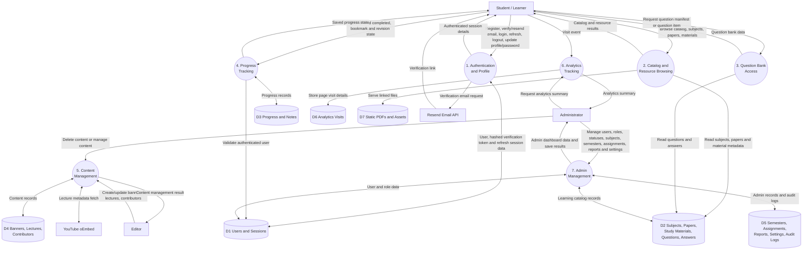

# DFD Level-1

## Explanation

This Level-1 DFD decomposes the main system into implemented backend processes: authentication, catalog/resource browsing, question bank access, progress tracking, content management, analytics and admin management.

## Notes / Assumptions

- The DFD focuses on implemented backend APIs registered in `backend/src/app.ts`.
- Progress is protected by authentication and stores completed, bookmarked and revision states.
- Authentication checks the `email-verification` application setting. Raw verification tokens are emailed but only their SHA-256 hashes and expiry times are stored.
- The Admin process controls whether verification is enforced and exposes provider configuration status without exposing the Resend API key.
- Discussion and chat pages are excluded from the main DFD processes because the visible backend route registration does not include active `/api/discussions` or `/api/chat` routers.
- `Note` exists in the Prisma schema, but implemented note APIs were not found in the current route list.
