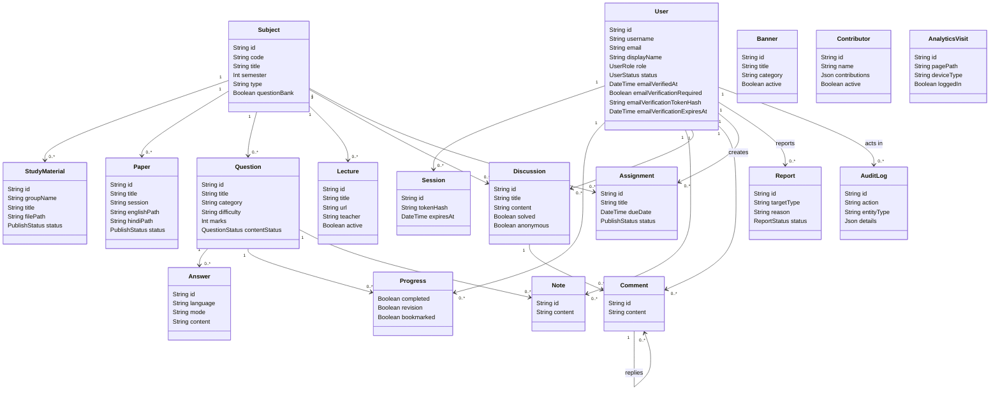

# UML Class Diagram

## Explanation

This class diagram summarizes the main persistent domain classes from the Prisma schema and their relationships. It is intentionally simplified for MCA project documentation.

## Notes / Assumptions

- This diagram is based on `backend/prisma/schema.prisma`.
- Supporting models such as `Semester`, `AppSetting` and `FileAsset` are not expanded to keep the diagram readable.
- `AppSetting` stores the Admin email-verification toggle; sensitive Resend credentials remain environment variables rather than database fields.
- `emailVerificationTokenHash` contains SHA-256 output, never the raw token sent to the user.
- `Discussion` and `Comment` are present in the database schema, although backend discussion routes were not registered in the current Express app.
