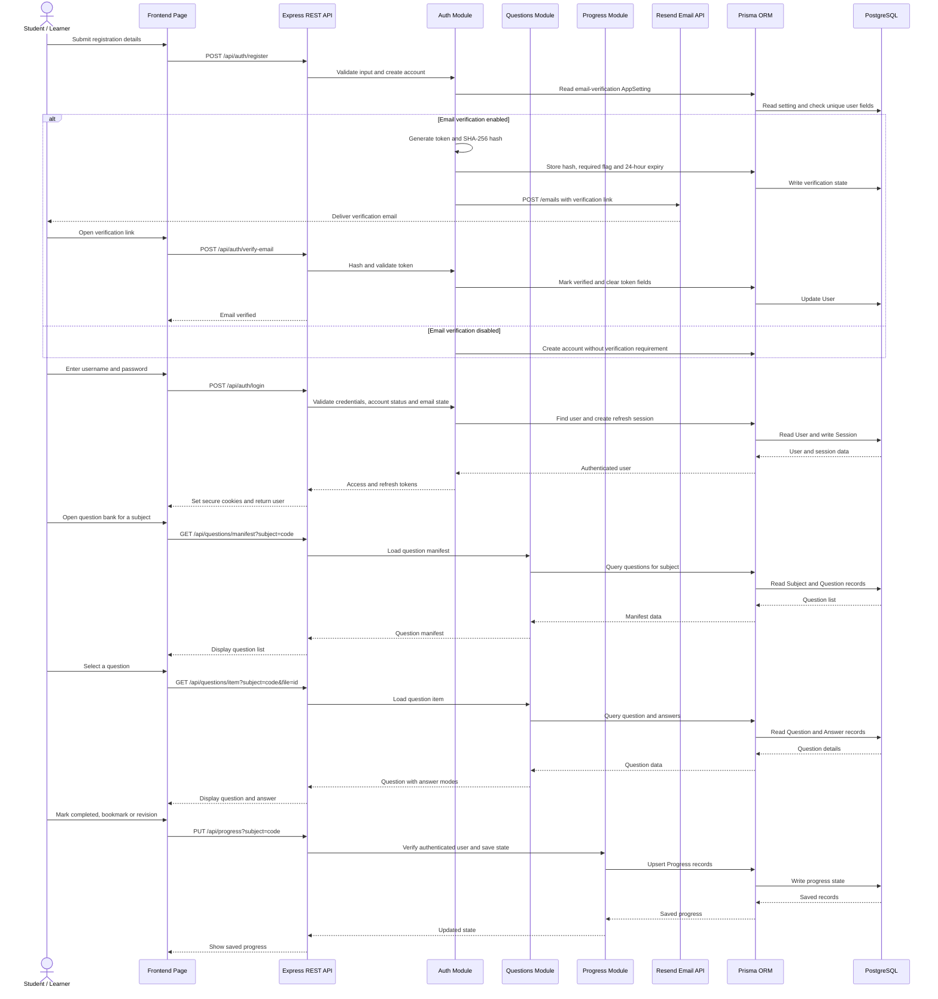

# UML Sequence Diagram

## Explanation

This sequence diagram shows registration, Resend email verification, login, question-bank browsing and progress saving across the frontend, Express modules, Prisma and PostgreSQL.

## Notes / Assumptions

- Authentication uses HTTP-only cookies named by the backend for access and refresh tokens.
- Verification links are single-use, expire after 24 hours and contain the raw token only in transit; PostgreSQL stores its SHA-256 hash.
- `POST /api/auth/resend-verification` rotates the token and returns a generic accepted response to reduce account enumeration.
- If Resend delivery fails during registration, the account remains created and the user can request another link.
- The frontend API client retries once through `/api/auth/refresh` when an authenticated request receives `401`.
- The diagram shows the database-backed flow; static resource pages and PDF viewing use served frontend assets in addition to API data.
