# UML Use Case Diagram

## Explanation

This UML use case diagram shows the main implemented interactions available to learners, editors and administrators.

```mermaid
flowchart LR
    Student["Student / Learner"]
    Editor["Editor"]
    Admin["Administrator"]

    subgraph System["GyanPath MCA Study Helper"]
        UC1(("Register / Login"))
        UC2(("View Profile"))
        UC3(("Update Profile / Password"))
        UC4(("Browse Subjects and Catalog"))
        UC5(("View Study Materials and Papers"))
        UC6(("Use Question Bank"))
        UC7(("Save Progress, Bookmarks and Revision"))
        UC8(("Record Page Visit"))
        UC9(("Manage Banners"))
        UC10(("Manage Lectures"))
        UC11(("Manage Contributors"))
        UC12(("Manage Users and Roles"))
        UC13(("Manage Subjects and Semesters"))
        UC14(("Manage Assignments"))
        UC15(("Review Reports"))
        UC16(("View Analytics and Audit Logs"))
        UC17(("Manage Application Settings"))
        UC18(("Verify Email / Resend Link"))
        UC19(("Enable / Disable Email Verification"))
    end

    Student --> UC1
    Student --> UC2
    Student --> UC3
    Student --> UC4
    Student --> UC5
    Student --> UC6
    Student --> UC7
    Student --> UC8
    Student --> UC18

    Editor --> UC1
    Editor --> UC9
    Editor --> UC10
    Editor --> UC11

    Admin --> UC1
    Admin --> UC9
    Admin --> UC10
    Admin --> UC11
    Admin --> UC12
    Admin --> UC13
    Admin --> UC14
    Admin --> UC15
    Admin --> UC16
    Admin --> UC17
    Admin --> UC19
```

## Notes / Assumptions

- Admin can perform all content-management operations; Editor can create/update content but delete content is guarded for Admin only.
- Public catalog, subject, paper and question APIs can be used without login, while profile and progress require login.
- When the Admin verification setting is enabled, newly registered users must complete UC18 before login; profile email changes also trigger UC18.
- UC19 is Admin-only and cannot be enabled until Resend server credentials are configured.
- The Prisma enum includes `MODERATOR`, but no implemented moderator-specific use cases were found in the active routes.
